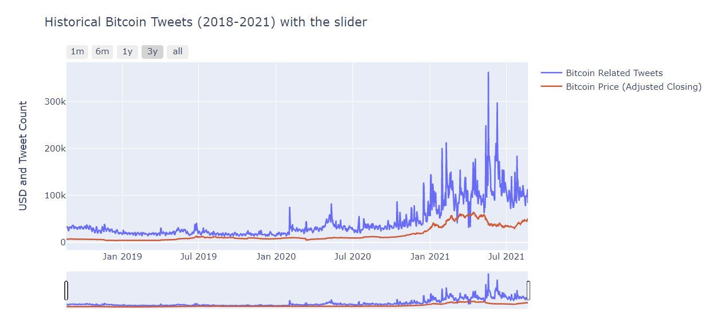

# Bitcoin Price Prediction: Project Overview
* Built a model that estimates Bitcoin Price (MAE ~ $1450 - 1500 USD) for every day in the coming month. 
* Scraped Bitcoin related Tweets and Market Cap for the current day all the way to 3 years ago which may aid in price estimation. 
* Optimized the Stacked LSTM Model using a grid search to reach the best model.
## Code and Resources Used
Python Version: 3.8

Packages: pandas, numpy, sklearn, matplotlib, seaborn, keras

For Web Framework Requirements: pip install -r requirements.txt

Bitcoin Price Dataset Used: https://finance.yahoo.com/quote/BTC-USD/history?p=BTC-USD

Referenced Sites: 
* https://coinmarketcap.com/currencies/bitcoin/historical-data/
* https://bitinfocharts.com/comparison/bitcoin-tweets.html#3y

Consolidated Articles: 
* https://machinelearningmastery.com/how-to-develop-deep-learning-models-for-univariate-time-series-forecasting/ 
* https://machinelearningmastery.com/how-to-develop-lstm-models-for-time-series-forecasting/
* https://machinelearningmastery.com/multivariate-time-series-forecasting-lstms-keras/
* https://machinelearningmastery.com/how-to-grid-search-deep-learning-models-for-time-series-forecasting/
## Web Scraping
Using Beautifulsoup, I implemented a scraper for the bitinfocharts site in order to get the following:
* Bitcoin related tweets for the past three years from the current day.
* Market Cap of Bitcoin for the past three years from the current day.
## Data Cleaning
After scraping the data, I needed to clean it up so that it would be useable for our EDA and perhaps for our model. I made the following changes and created the following variables:
* Filled out missing entries from our yahoo dataset by referencing the coinmarketcap link above.
* Imputing missing tweet rows by using the linear-forward method.
* Created a new column known as "Proportion of Bitcoin Traded" by getting the volume traded and dividing by the total market cap for that given day. 
## EDA
 I looked at the correlations of the data as well as some of the seasonality/distributions of the time series. 
 Below are some of the few highlights:
 
  
 
 The correlations above is most noticable observing the trend of Bitcoin related tweets in relation to Bitcoin price during the start of 2021:
 
 

## Model Building
All models described below only pertain to the univariate case. Implementing a multivariate model is doable for one time step but is significantly more complicated when attempting to forecast several time periods (multi-steps) into the future and hence a univariate model was favored in predicting several weeks into the future.

I tried four different models and evaluated their configurations in the grid search using Root Mean Squared Error. I chose RMSE in order to account for the volatility and high likelihood of outliers in this type of investigation. 

Here are the four different models:

* ARIMA – Default Model

Deep Learning Models:
* Vanilla LSTM - Our Baseline LSTM which consts of a single hidden layer of LSTM units, and an output layer used to make a prediction.
* Stacked LSTM with 1 Hidden Dense Layer – A quick experiment to improve any vanilla LSTM would be to stack a single/multiple hidden LSTM layers on top of one another.
* Bidirectional LSTM – Due to the volatility of Bitcoin Prices, it can be beneficial to allow the LSTM model to learn the input sequence both forward and backwards to concatenate both interpretations.
## Model Performance 
The Bidirectional model outperformed the other approaches on the test and validation sets. Given the stochastic nature of the algorithm and evaluation procedure, I ran each model ten times to compare the average outcome: 
* ARIMA: RMSE = 3662, MAE = 3595
* Vanilla LSTM: RMSE = 3130, MAE = 3022
* Stacked LSTM with 1 Hidden Dense Layer: RMSE = 1539, MAE = 1514
* Bidirectional LSTM: RMSE = 1509 , MAE = 1478
## Productionization
The goal is to have a local webserver regularly forecast these prices every single day.
